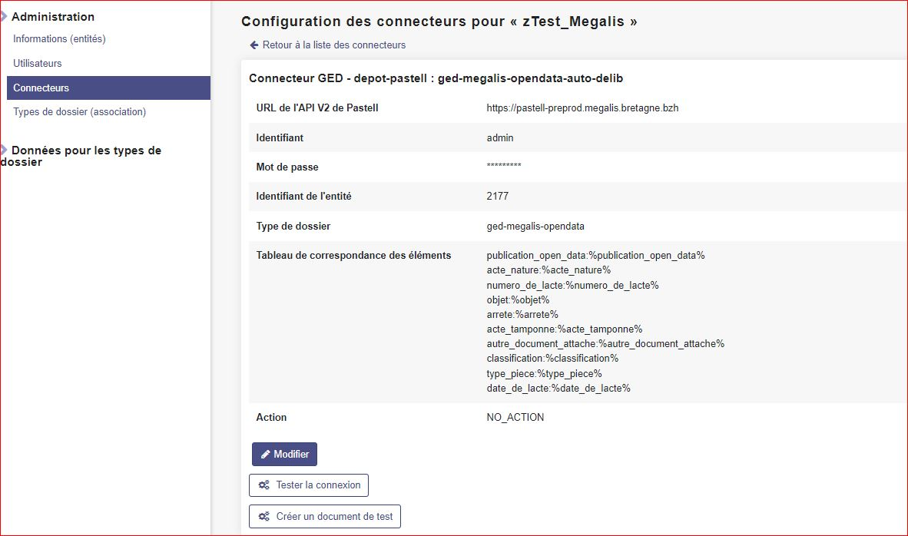
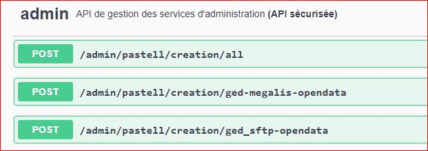

Paramétrage Pastell
===========================

Patch connecteur GED SFTP
--------------------------

.. note::
  Dans l'attente d'une évolution sur le produit pastell de libriciel, il est nécessaire de patcher le connecteur GED SFTP afin d'ajouter le Siren de l'organisme dans le fichier metadata

|Trois fichiers doivent être patché:
|  - pastell-core/DonneesFormulaire.class.php
|  - connecteur-type/GED/GEDEnvoyer.class.php
|  - connecteur-type/DepotConnecteur.class.php

Une merge request du patch est disponible sur le gitlab de libriciel https://gitlab.adullact.net/guenneuguesy/pastell/-/merge_requests/1

.. tabs::

   .. tab:: DonneesFormulaire

      .. code:: php

        /** @var  DocumentIndexor */
        private $documentIndexor;
        //==>DEBUT Patch
        private $siren;
        private $ide;
        //==>END Patch
        /**
         * DonneesFormulaire constructor.
         * @param $filePath string emplacement vers un fichier YML
         *                  contenant les données du document sous la forme de ligne clé:valeur
         * @param DocumentType $documentType
            foreach ($this->getFormulaire()->getAllFields() as $field) {
                $this->setFieldData($field->getName());
            }
        }
        ...
        ...
        ...

        //==>DEBUT Patch
        public function setIdE($ide)
        {
            $this->ide = $ide;
        }
        public function getIdE()
        {
            return $this->ide;
        }
        public function setSiren($siren)
        {
            $this->siren = $siren;
        }
        public function getSiren()
        {
            return $this->siren;
        }
        //==>END Patch
        private function setFieldData($fieldName, $ongletNum = -1)
        {

   .. tab:: GEDEnvoyer

      .. code:: php

        public function go()
           {
               $action_for_unrecoverable_error = $this->getMappingValue(FatalError::ACTION_ID);
               $has_ged_document_id = $this->getMappingValue('has_ged_document_id');
               $ged_document_id_file = $this->getMappingValue('ged_document_id_file');

               $donneesFormulaire = $this->getDonneesFormulaire();

               //==>DEBUT Patch
               $sirenBDD =  $this->objectInstancier->EntiteSQL->getSiren($this->id_e);
               $donneesFormulaire->setIdE($this->id_e);
               $donneesFormulaire->setSiren($sirenBDD);
               //==>FIN Patch

               /** @var GEDConnecteur $ged */
               $ged = $this->getConnecteur("GED");

   .. tab:: DepotConnecteur

      .. code:: php

        if ($meta_data_included) {
            foreach ($raw_data as $key => $d) {
                if (!in_array($key, $meta_data_included)) {
                    unset($raw_data[$key]);
                }
            }
        }

        //==>DEBUT Patch
        $raw_data["id_e"] =  $donneesFormulaire->getIdE();
        $raw_data["siren"] =  $donneesFormulaire->getSiren();
        //==>FIN Patch

        if ($depot_metadonnees == self::DEPOT_METADONNEES_YAML_FILE) {
            $data = Spyc::YAMLDump($raw_data);
            $extension_filename = '.txt';
        }

Création Flux Studio ged-opendata
----------------------------------

| Se connecter en admin dans pastell et aller dans administration avancée
| Sélectionner **Type de dossier -> Type de dossier (Studio)**
| Puis importer `ce fichier json`_
.. _ce fichier json: https://github.com/megalis-bretagne/opendata-extraction/blob/master/pastell/super-ged-megalis.json

Creation et association
---------------------------

| **Creation GED SFTP**

| Pour un organisme :
| Aller dans **Administration -> Connecteurs **
| Cliquer sur le bouton ajouter
| Sélectionner Dépôt FTP (GED)
| Paramétrer le connecteur

| **Association GED SFTP**

| Pour un organisme :
| Aller dans **Administration -> Type de dossier (association) **
| Associer le connecteur GED SFTP précédemment paramétré au nouveau flux studio ged-opendata

| **GED PASTELL**

.. note::
  Dans un flux studio existant, ou vous souhaitez mettre en place la publication opendata, ajouter une étape GED PASTELL qui appellera le flux studio précédemment créé.

| **Creation GED PASTELL**
Pour un organisme :
| aller dans **Administration -> Connecteurs **
| Cliquer sur le bouton ajouter
| Selectionner Dépôt Pastell (GED)
| Paramétrer le connecteur (cf screen ci-dessous)

| **Association PASTELL**
| Pour un organisme :
| Aller dans **Administration -> Type de dossier (association) **
| Associer le connecteur GED PASTELL précédemment paramétré avec le flux studio ou vous souhaitez ajouter l'étape de publication opendata

Creation et association en masse (automatique)
---------------------------

.. note::
  Le projet opendata-extraction dispose d'un service permetant la creation et l'association en masse.

