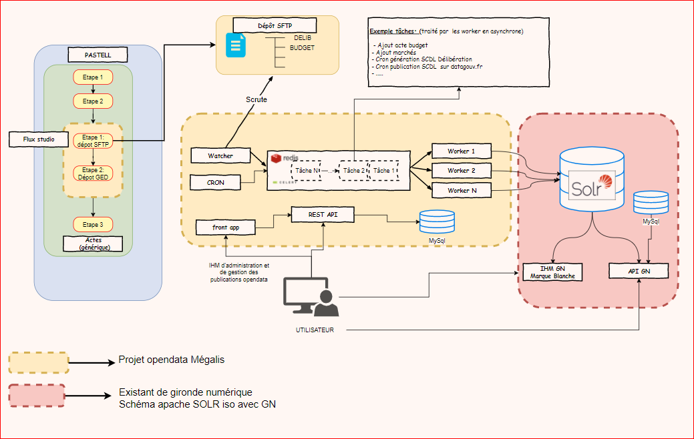

# Présentation du projet

## Résumé
Le but du projet est d'automatiser la publication et la gestion de différents jeux de données en open data depuis la plateforme de services de Mégalis Bretagne.

Il permet la génération et la publication des jeux de données suivants:
* les délibérations ([fichier annuel au format SCDL délibération](https://schema.data.gouv.fr/scdl/deliberations/2.1.3/documentation.html)  et fichier PDF sur marque blanche)
* les budgets ([fichier annuel au format SCDL budget](https://schema.data.gouv.fr/scdl/budget/0.8.1/documentation.html) et fichier PDF sur marque blanche)
* les marchés publics ([fichier annuel format-commande-publique](https://github.com/139bercy/format-commande-publique))

Une IHM permet aux utilisateurs de gérer leurs publications et des APIs sont disponibles pour automatiser différentes actions.

Enfin, une réutilisation de [la marque blanche de gironde numérique](https://gitlab.adullact.net/gironde-numerique/data-search-engine) est possible.

##Schéma d'architecture

## Les projets

### Projet : opendata-extraction
L'application permet de gérer les publications opendata de Megalis Bretagne.

En fonction du mode de lancement l'application:
- Expose une API REST (mode runserver)
- Déclenche des tâches périodiques (mode beat)
- Exécute des tâches (mode worker)
- Scrute un répertoire (mode watcher)

Repo : https://github.com/megalis-bretagne/opendata-extraction.git

**Les Technologies utilisées**
* Python 3.9
* Flask
* Celery
* SQLAlchemy
* Apache Solr
* Mysql

### Projet : opendata-frontapp
IHM de gestion des publications à disposition des utilisateurs du service.

Repo : https://github.com/megalis-bretagne/opendata-frontapp.git

**Les Technologies utilisées**
* Angular 11
* Angular Material
* NGRX

### Projet : marque blanche
Moteur de recherche des données publiques pour collectivités. Disponible sous forme d'Iframe à ajouter sur le site de la collectivité.
| Fork du projet : https://gitlab.adullact.net/gironde-numerique/data-search-engine

Repo : https://github.com/megalis-bretagne/opendata-marque-blanche.git

**Les Technologies utilisées**
* PHP > 7.2
* Extension Apache Solr
* Apache Solr

**Test**

