# Service de publication

## Accéder au service de publication 

Pour accéder à nos services, rendez-vous sur notre site
https://www.megalis.bretagne.bzh cliquez sur **"se connecter"**

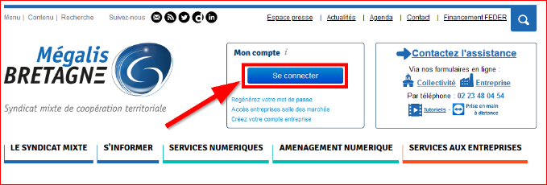

Renseignez votre **login** (mail) et votre **mot de passe** , puis cliquez sur "Connexion" pour vous connecter à votre compte.

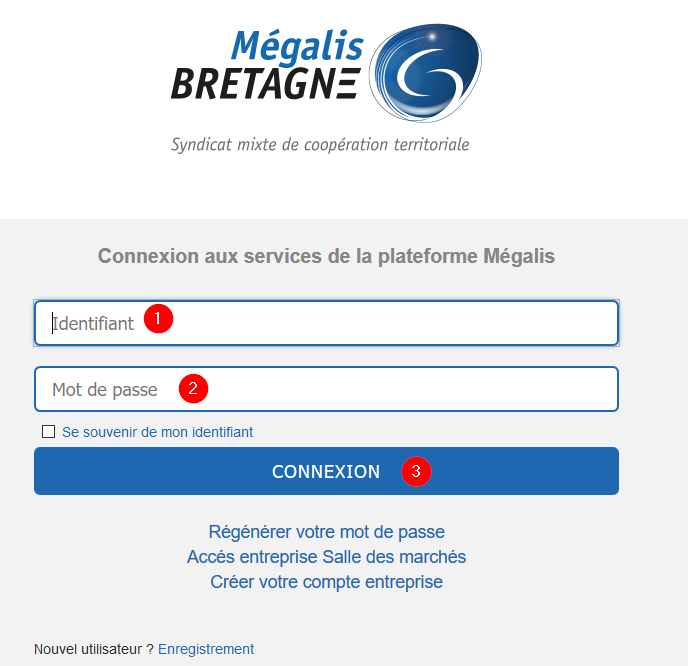

Après vous être identifié, cliquez sur :**"Mes services"**.

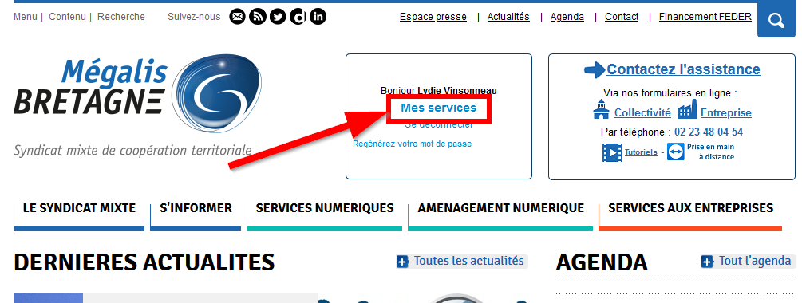

Cliquez ensuite sur **"Accéder"** dans la rubrique **"Publication open data"**  :

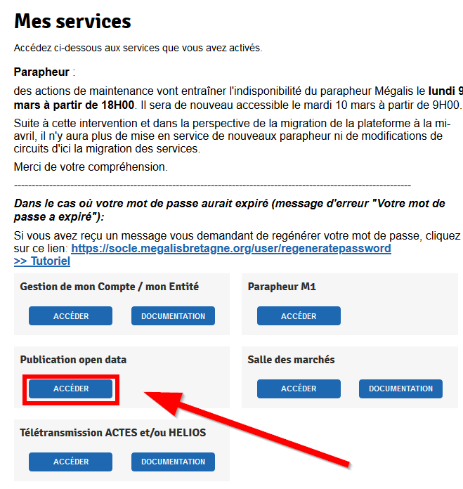

Si le pavé **"Publication opendata"** ne s'affiche pas, c'est sans doute une question de droits d'accès, n'hésitez pas à contacter l'assistance pour les vérifier.
Normalement, tous les administrateurs et utilisateurs de la télétransmission ont les droits pour accéder à ce service de Publication opendata.

## Description du menu général

Dans le menu, vous disposez de 4 sous-menus :
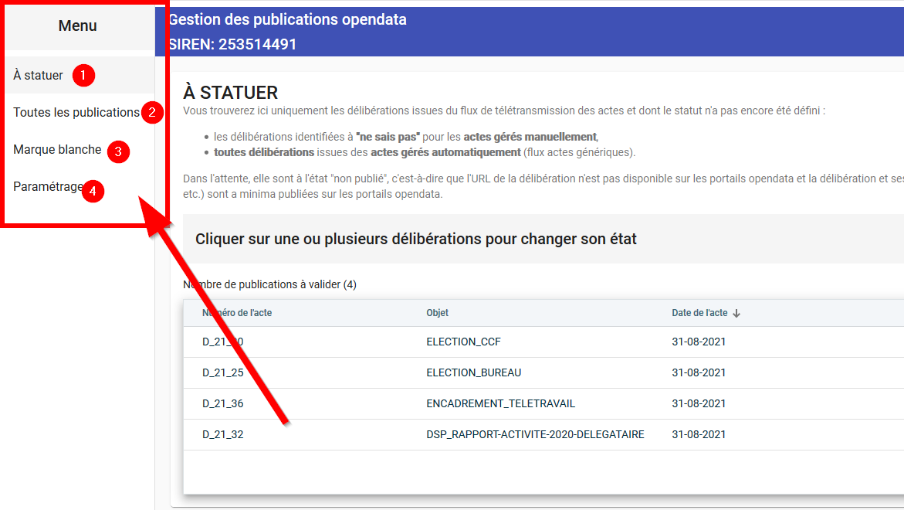

1. Liste des délibérations dont le statut de publication opendata n'est pas encore défini et qui doivent être "statuées" (cf. ## Statuer sur l'état de publication d'une délibération mise à "ne sais pas""),
2. Liste de l'ensemble des délibérations : on peut revenir sur leur statut à tout moment (cf. ## Visualiser et modifier le statut "publié" ou "non publié" de vos publications),
3. Code source et aperçu de la "marque-blanche" (cf. ## Visualiser et récupérer le code de la marque-blanche),
4. Possibilité d'activer ou non la publication opendata (cf. ## Activer ou non votre publication opendata).

## Statuer sur l'état de publication d'une délibération mise à "ne sais pas"

Dans le menu **"À statuer"**, vous trouverez uniquement les délibérations issues du flux de télétransmission des actes et dont le statut n'a pas encore été défini :

+ les délibérations identifiées à "ne sais pas" pour les actes gérés manuellement,
+ toutes délibérations issues des actes gérés automatiquement (flux actes génériques).

Dans l'attente, elles sont à l'état **"non publié"**, c'est-à-dire que l'URL de la délibération n'est pas disponible sur les portails opendata et la délibération et ses annexes ne sont pas publiées sur la marque blanche. Les métadonnées de la délibération (nom, objet, date, etc.) sont a minima publiées sur les portails opendata.
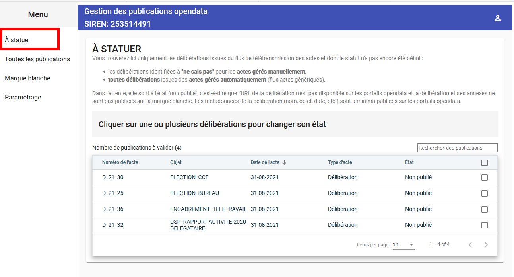

### Mode opératoire pour trancher le statut d'une délibération

Cliquer sur la ligne de la délibération visée **(1)**, et vous verrez les boutons apparaître **(2)** :

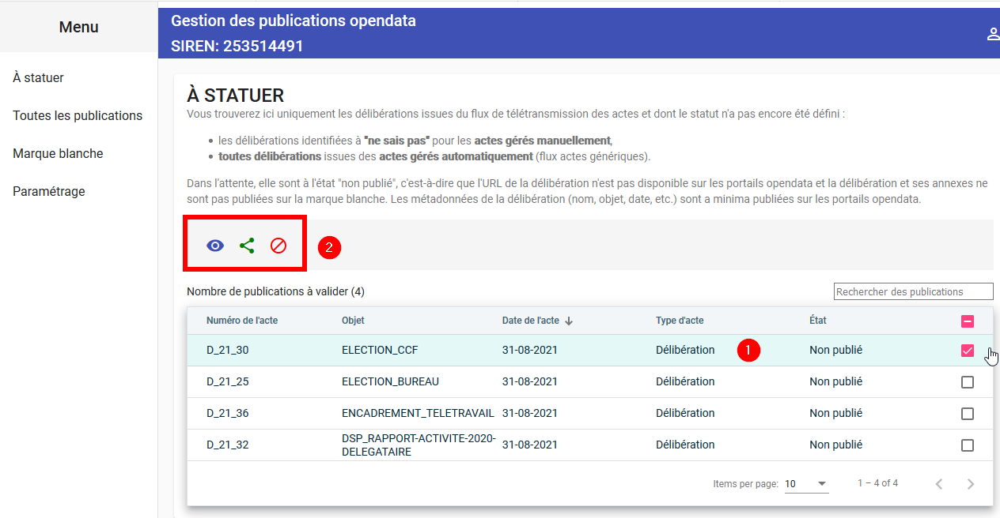

Vous pouvez **visualiser** la délibération avec l'oeil :

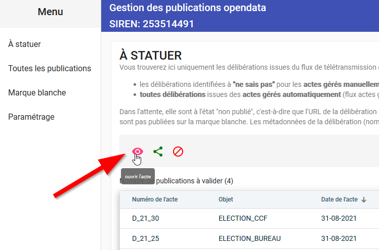

Vous pouvez **publier** le document visé avec le bouton **vert** :

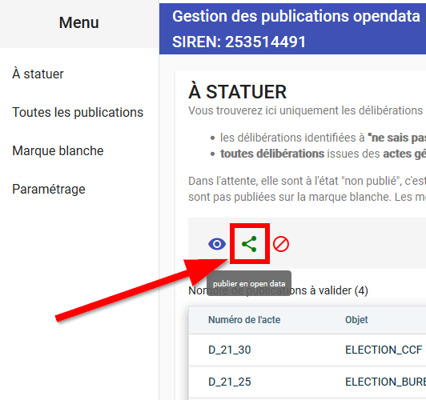

Vous pouvez **dépublier** le document visé avec le bouton **rouge** :

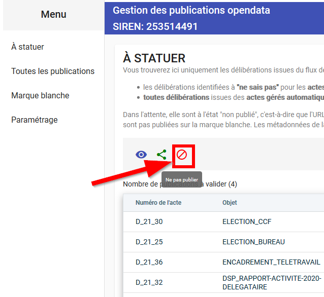

Dès que vous cliquez sur **publier** ou **dépublier**, la ligne disparaît puisque vous avez statué sa publication.

Vous pouvez à tout moment **revenir sur le statut de publication d'un document** en allant sur le menu ****"Toutes les publications" (cf. ## Visualiser et modifier le statut "publié" ou "non publié" de vos publications).

### Mode opératoire pour trancher le statut de plusieurs délibérations en même temps

Cliquer sur les lignes de délibérations visées, **(1)** et **(2)** dans l'exemple ci-dessous, et vous verrez les boutons apparaître **(3)** :

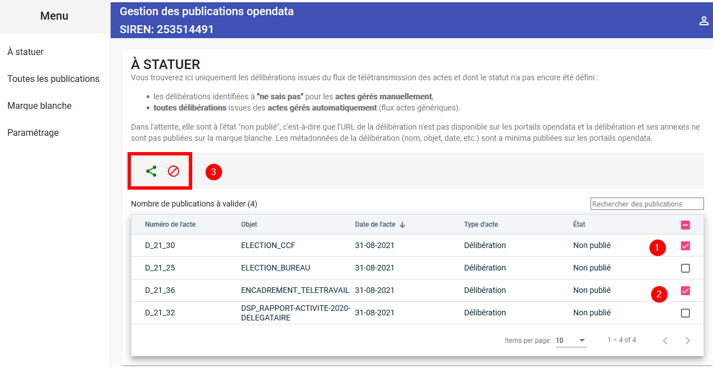

Vous pouvez **publier** les documents visés avec le bouton **vert** :

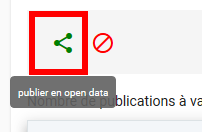

Vous pouvez **dépublier** les documents visés avec le bouton **rouge** :

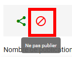

Dès que vous cliquez sur **"publier"** ou **"dépublier"**, les lignes sélectionnées disparaissent de la liste puisque vous avez statué sur leur publication.

Vous pouvez à tout moment revenir sur le statut de publication d'un document en allant sur le menu **"Toutes les publications"** (cf. ## Visualiser et modifier le statut "publié" ou "non publié" de vos publications).

**ASTUCE** : pour modifier en même temps le statut de publication de toutes les délibérations, sélectionnez les toutes en cliquant en haut à droite de la colonne des cases à cocher :

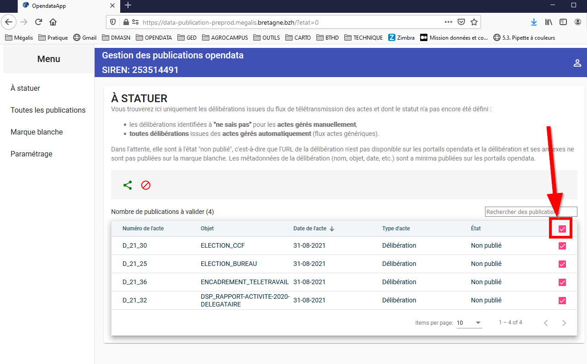

## Visualiser et modifier le statut "publié" ou "non publié" de vos publications

## Visualiser et récupérer le code de la marque-blanche

## Activer ou non votre publication opendata
